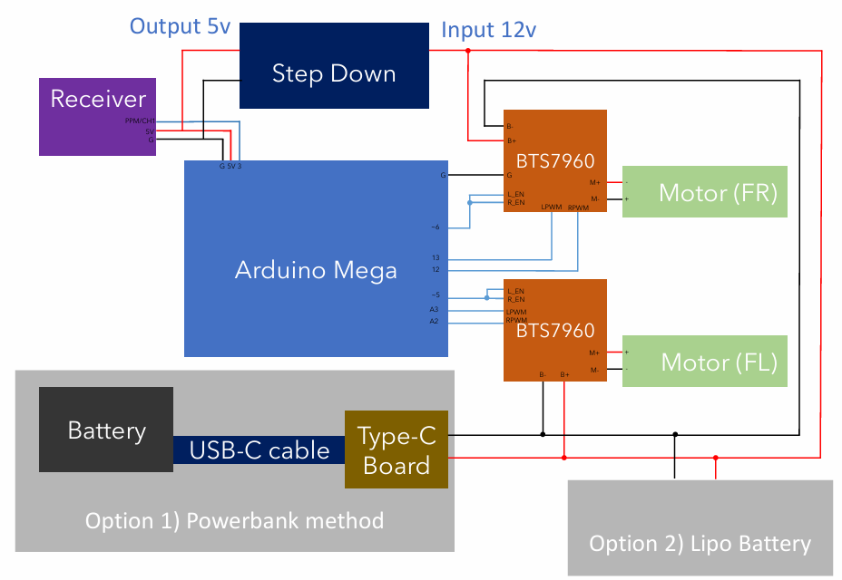

# Roboclash 2023

Arduino based RC-controlled bot that collects and deposits spheres through a conveyor belt system.

 

Base model

 

Finalised bot with mechanisms

## Usage

1. Download [CH340 Driver](https://sparks.gogo.co.nz/ch340.html) & install PPM-reader in [Arduino sketch's](https://www.arduino.cc/en/software) Library Manager.

2. Ensure that motors and parts are correctly installed, along with the RC controller set-up. Refer to appendix for more details.

3. Run `joystick-control.ino` in Arduino Mega.

## Appendix

### Wiring diagram

 

- Arduino PWM pin go to both the `L_EN` and `R_EN` pins on the BTS7960 to control the speed of motors via `analog_Write`
- Arduino (non or pwm) pins go to the `L_PWM` and `R_PWM` pins on the BTS7960 to control the direction of these pins

| L_PWM (digital write) | R_PWM (digitalWrite) | Direction |
| :-------------------: | :------------------: | :-------: |
|         High          |         Low          |  Forward  |
|          Low          |         High         | Backward  |
|         High          |         High         |   Stop    |
|          Low          |         Low          |   Stop    |

### Radio Transmitter Setup

This tutorial are for FlySky FS-i6S and Turnigy TGY-i6S radio transmitters for remotely controlling the bot.

The radio transmitter needs to be set to PPM mode.
For video demonstrations: [FlySky FS-i6S](https://www.youtube.com/watch?v=en10O9Wf_D8) and [Turnigy TGY-i6S](https://www.youtube.com/watch?v=D6ZH_D-QAng)

1. Turn Transmitter on by holding both power buttons.
2. FlySky FS-i6S: Tap and hold the 'lock' icon until it unlocks.
   Turnigy TGY-i6S: Skip to step 3.
3. Tap the settings icon.
4. FlySky FS-i6S: Tap the 'system' tab.
   Turnigy TGY-i6S: Skip to step 5.
5. Scroll down to 'output mode' and tap on it.
6. Select 'PPM' mode.
7. Press the back key.
8. Turnigy TGY-i6S: Tap 'Y'.

Next, we will set the auxiliary channels.
For video demonstrations: [FlySky FS-i6S](https://www.youtube.com/watch?v=65abX_aTCBs) and [Turnigy TGY-i6S](https://www.youtube.com/watch?v=EIceM0KDCqE)

1. Turn Transmitter on by holding both power buttons.
2. FlySky FS-i6S: Tap and hold the 'lock' icon until it unlocks.
   Turnigy TGY-i6S: Skip to step 3.
3. Tap the settings icon.
4. FlySky FS-i6S: Tap the 'func' tab.
   Turnigy TGY-i6S: Skip to step 5.
5. Scroll down to 'aux.channels'.
6. Select channel number using left/right arrow buttons
7. Tap on auxiliary channel 'type' icon (icon with a rounded square around it).
8. Select type of input (nothing, variable knob, main stick, rear key/button or switch).
9. Tap on auxiliary channel mapping icon (icon to the right of auxiliary channel 'type').
10. Select desired input.
11. Tap the back button.
12. Turnigy TGY-i6S: Tap 'Y'.
13. Testing: From the main screen swipe from left to right to view channel outputs. Turn/flip/press the input and view he change on the display to verify if correct.
